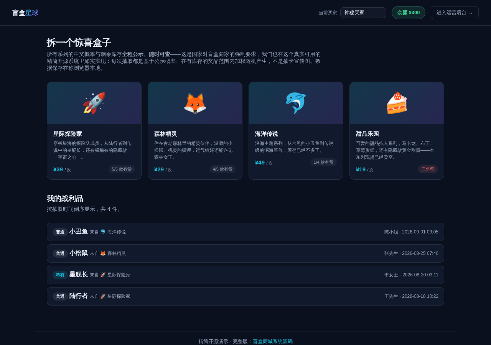

# 盲盒商城系统（精简开源版）· Blindbox Lite

**[在线体验（前台）→](https://anna123123123-creator.github.io/blindbox-lite/)** · **[运营后台 →](https://anna123123123-creator.github.io/blindbox-lite/admin.html)**

免费开源的盲盒商城系统精简版。这不是截图或原型图，是一个**真实可用**的前后台系统：系列浏览、概率公示、余额扣费、库存感知抽取、抽取历史，后台系列与概率库存增删改查、真实收入统计——都是真功能，纯前端 + `localStorage` 实现，不需要服务器、不需要数据库，克隆下来打开就能用，也适合作为学习或二次开发的起点。



## 概率公示，全程透明

按照国内对盲盒经营者的监管要求，每个系列的中奖概率必须公开披露。这个系统把它当作一等公民来实现：进入任意系列，奖品名称、类型（普通/稀有/隐藏）、公示概率、剩余库存**始终可见**，不是藏在客服话术或用户协议里的小字。已售罄的奖品仍然完整展示在概率表里（只是标注"已售罄"），保证用户看到的是完整、真实的奖池信息，而不是被悄悄隐藏。

## 功能

**前台（买家视角）**
- 系列列表浏览，实时显示单价与"X/Y 款有货"
- 点开系列查看完整的奖品概率表（名称/类型/概率/剩余库存），概率始终公示，已售罄奖品单独标注
- "抽一个"：自动校验余额是否充足（不足会显示还差多少钱）、校验系列是否还有库存（全部售罄会拦截），抽取只在**有库存的奖品范围内**按公示概率加权随机，抽中后立即扣费、减库存、生成中奖记录并展示揭晓动画
- "我的战利品"：按时间倒序显示所有抽取记录，随时可查看余额

**后台（运营视角）**
- 仪表盘：系列总数、抽取总次数、总收入、本月收入（均为真实汇总计算），按稀有度统计抽取次数
- 系列管理：新增、编辑、删除系列（名称/单价/封面图标/简介），删除会级联清空该系列的奖品与抽取记录
- 概率与库存：按系列管理奖品的名称、类型、概率、库存，**保存时强制校验该系列所有奖品概率之和必须正好等于 100%**，不满足会被拦截并给出明确错误提示
- 抽取记录：全部抽取历史，可按系列筛选，显示买家/系列/奖品/类型/时间

## 试用方法

克隆下来，直接用浏览器打开 `index.html`，或用静态文件服务器跑起来：

```bash
python3 -m http.server 8000
```

前台在 `index.html`，后台在 `admin.html`。所有数据存在浏览器的 `localStorage` 里（`blindbox_lite_data_v1` 这个 key），后台侧边栏有"重置示例数据"按钮可以随时清空重来。

## 技术说明

没有用任何框架或构建工具，纯原生 HTML/CSS/JavaScript，一共 4 个文件：`data.js`（数据层，负责 localStorage 读写和种子数据）、`index.html` + `script.js`（前台）、`admin.html` + `admin.js`（后台）。因为是纯前端 Demo，数据只存在当前浏览器里，不同设备/浏览器之间不会同步，也没有真实的支付和物流对接——真实生产系统需要一个后端 API 和数据库来替换 `data.js` 里的存储层，并接入真实支付渠道与发货物流，其余的界面和交互逻辑基本可以直接复用。

## 协议

MIT，随便怎么用都行。

## 相关项目

这是完整版**盲盒商城系统**的精简开源示例——完整版支持真实支付与发货物流对接、隐藏款保底机制、赛季限定款与预售、社区晒单与转卖交易等能力，源码在这：[全能源码 · 盲盒商城系统源码](https://inzyxuashop.com/manghe-yuanma.html)。
